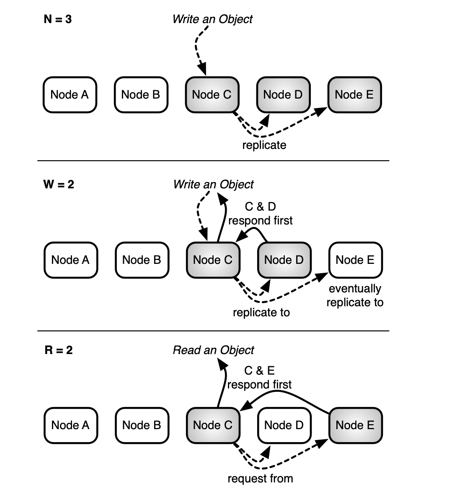

# CAP Theorem:

## Statement:

-   We&rsquo;re talking mostly in a distributed database systems (nodes) context.
-   C: Consistency.
-   A: Availability.
-   P: Partition Tolerance.
-   We can only have two of the three at the same time.

## Clarification

-   The Theorem deals in absolute terms.
-   In practical terms, the missing attribute can be reached partially.

## Illustration:

## Simplifying:

-   A distributed system should work even with network failures, so we need P.
-   We have two choices then:
    1.  A+P: Always available, partition-tolerant.
    2.  C+P: Consistent, partition-tolearnt

# Riak Core

## What is it?

-   Erlang Framework.
-   Based on the Dynamo Paper.
-   Open Source base for Riak K-V, TS and others.

## Dynamo:

-   NoSQL (Key-Value).
-   A+P, with eventual consistency.
-   Easily scalable.
-   Tunable AP system.

## Keep this in mind for now:

## Riak Core provides:

### Virtual Nodes:

-   We can think about them &rsquo;like&rsquo; running Riak Core instancies.
-   They share behaviour.
-   Distribute work between them.
-   Varios en una mismo servidor.
-   They share the ring.

### Consistency Hashing:

-   A given key is turned into a number.
-   The number determines in which part of the ring the key ends up.
-   Cheap to reassign keys if a node fails.

### Handoff:

-   The way in which keys are distributed among keys.
-   Each node has a portion of the ring.
-   Each node may have a back-up

## Let&rsquo;s see it again

## Tunable AP:

# What I&rsquo;ve been doing:

## Tutorial:

-   A couple of years ago, Lambdaclass wrote a tutorial about Riak Core
-   It&rsquo;s mostly how to set it up using Erlang.
-   The result is a Key-Value store.

## Issues:

-   It was some OTP versions behind of the current one.
-   We were using a Riak Core fork.
-   rebar3 configs not working as expected.
-   Deprecated modules in OTP 25 (eg: peer vs slave).

## Solution:

-   Opening issues on Github.
-   Erlang slack.
-   Erlang forums.
-   Reading source code.

## Result:

-   It turned out that the peer module is really new.
-   The rebar3 config error turned out to be a rebar3 bug.

### Rebar&rsquo;s latest release:

# What I&rsquo;m currently doing:

## Elixir + Riak Core:

-   I&rsquo;m doing something similar to the Erlang tutorial, but with Elixir.
-   The plan is to also be able to easily use Riak Core
